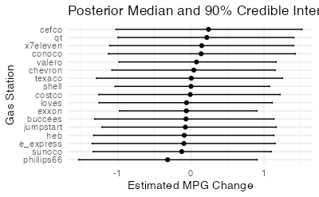

# GasMileage

I have long been curious if gas stations differ meaninfully in gas quality. Everyone seems to have an opinion, so I decided to collect data from my own fueling and driving experiences for the past few years. For two vehicles, I recorded the mileage, gallons of gas, and gas type for each trip.

Since each trip typically does not empty the gas tank completely, I estimate the proportion of gas from each station remaining in the tank over time. For example, if a tank is initially filled entirely with Valero gas, then half is used and replace with Exxon gas, the tank contains equal parts Valero and Exxon. If half the tank is used again and replaced with Chevron gas, the composition becomes approximately 50% Chevron, 25% Exxon, and 25% Valero.

Using this tank composition data, I infer how miles per gallon (MPG) varies by gas station. Admittedly, many other factors affect MPG - weather, driving speed, and road conditions all play significant roles. These are difficult to track, so I make the simplifiying assumption that such factors ocareur independent of tank composition. While this assumption may introduce bias, it is necessary for the analysis.

I model MPG using a hierarchical Bayesian normal-normal framework. The MPG on trip $i$ is modeled as:

$$y_i | \alpha, \delta, \sigma^2, W_i, C_i \sim N(C_i^T \alpha + W_i^T \delta, \sigma^2),$$

where $\sigma^2$ is the error variance, $\alpha$ is the vehicle-specific intercept, $\delta$ is a vector of gas station effects, $W_i$ represents the tank composition for that trip, and $C_i$ is a one-hot encoded vector containing the vehicle driven. Both $\alpha_i$ and $\delta$ have normal priors:

$$\alpha_i|\theta, \tau \sim N(\theta, \tau),$$
$$\delta_j| \gamma \sim N(0, \gamma),$$

for $j = 1, \ldots, p$ gas stations. To capture uncertainty in the vehicle-level mean, $\theta$ itself has a normal prior:

$$\theta| \mu, \phi \sim N(\mu, \phi),$$

where $\mu$ is be typically between 20 and 30 MPG to reflect typical vehicle efficiency. Hierarchical half-Cauchy priors are placed on the variance parameters (following Gelman, 2006):

$$\sigma^2| \lambda_{\sigma} \sim \text{Half-Cauchy}(0, \lambda_{\sigma}),$$
$$\tau | \lambda_{\tau} \sim \text{Half-Cauchy}(0, \lambda_{\tau}),$$
$$\gamma | \lambda_{\gamma} \sim \text{Half-Cauchy}(0, \lambda_{\gamma}).$$

These Half-Cauchy priors can be re-expressed as inverse-gamma distributions, enabling efficient Gibbs sampling. I derive the full conditionals and implement an MCMC sampler to draw posterior samples.

The dataset currently contains 99 observations across two vehicles and 17 gas stations. Below is a plot showing the estimated change in MPG associated with each gas station:

So far, I have not identified strong evidence that any particular gas station significantly affects MPG. However, as more data becomes available, these differences may become more clear.
